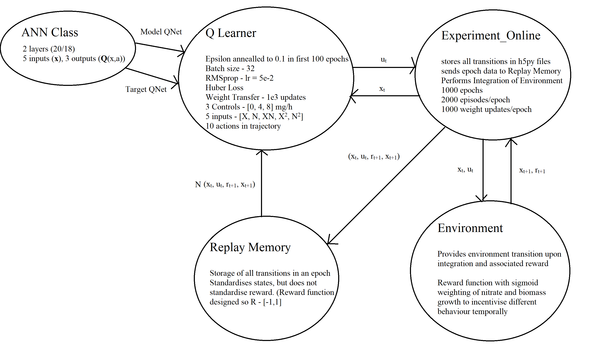

# DQN
Folder for dynamic optimisation of simple fed-batch fermentation with Deep Q Networks.

### ExpDesign.py 
 - File is central integrator that runs the program

### QLearner.py 
- Defines the model and target network,  hyperparameters associated with training
and the randomness of the e-greedy policy, which decays per epoch.

### Experiment_Online.py 
- Enables integration of decision making of the agent with dynamics of the environment and steps
environment to the next t, over a number of episodes of experience and training rounds/epochs. Also determines
the number of weight updates per epoch. 

### Replay_Memory.py
- Experience replay acts as a datastore to smooth the data distribution. Data capacity for an epoch of experience. 

### Environment_file.py
- Contains definition of the bioprocess we want to dynamically optimise.

 

